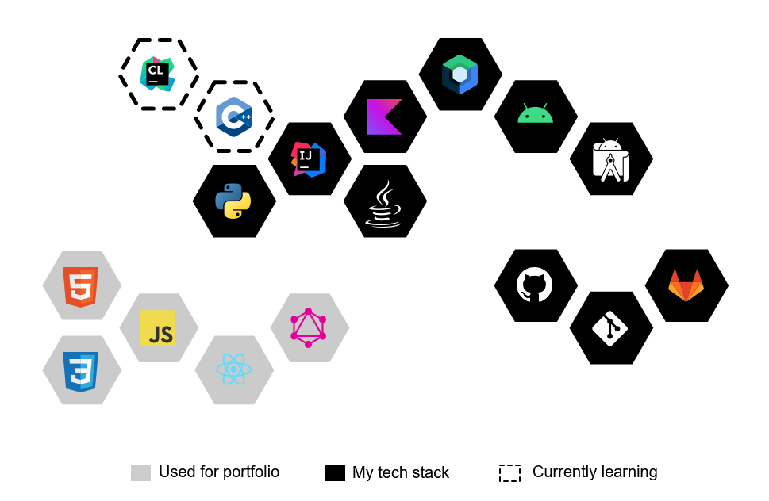

  

<h3 align="center">Hi, I'm Chantal :maple_leaf:</h3>

In 2018 I was an equine veterinarian :racehorse: completing a surgical internship.

Now I look at fewer x-rays & do a lot more maths.

I built a website!:tada: It's got the blog posts that I write when I'm feeling nostalgic for academia.

Kotlin is very much my main enthusiasm, but I'm trying to grow my Python and C++ skills :seedling:.

Feel free to let me know if you have any tips, questions, or suggestions for improvement in any of my repos.

Or if you just want to know what getting an upper-cut from a 600kg animal feels like :upside_down_face:.

 

  

