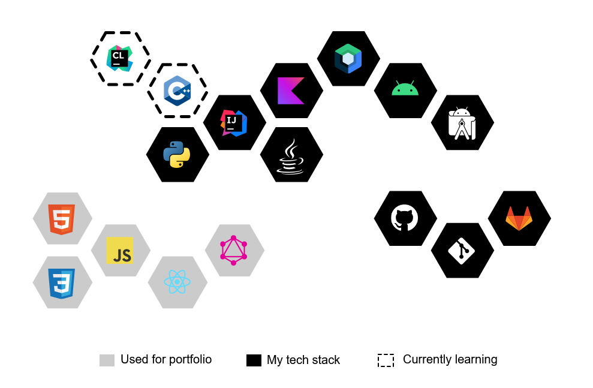

  

### Hi, I'm Chantal 👋

In 2018 I was an equine veterinarian completing a surgical internship. 

I was an equine veterinarian in a past life.

Now I read fewer x-rays & do a lot more maths.

  <map name="links">
    <area href="https://kotlinlang.org/" alt="Checkout Kotlin" target="_blank" shape="poly" coords="470,116420,116545,159420,202470,202445,159"/>
  </map>
  

I use  when I'm feeling nostalgic.